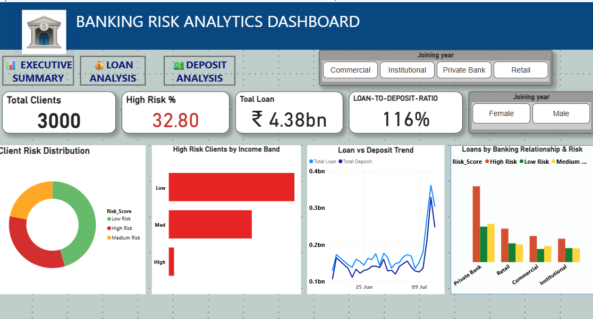

# 🏦 Banking Risk Analytics Dashboard

## 📌 Project Overview
Banks face significant financial risk when lending to customers who may default. This project focuses on **banking risk analytics**, combining **Python-based exploratory data analysis (EDA)** with an **interactive Power BI dashboard** to help stakeholders assess credit risk, exposure concentration, and liquidity imbalance *before* approving or expanding loans.

The solution enables data-driven decision-making by identifying high-risk clients, monitoring loan-to-deposit imbalance, and highlighting safer growth opportunities.

---

## 🎯 Business Problem
Poor credit risk assessment can lead to:
- High non-performing assets (NPAs)
- Liquidity stress due to loan–deposit imbalance
- Excessive exposure to high-risk client segments

**Objective:**  
To analyze customer, loan, and deposit data to:
- Evaluate repayment likelihood
- Identify high-risk exposure
- Improve portfolio stability and lending decisions

---

## 🗂️ Dataset Description
The dataset contains historical banking data with:
- Client demographics (Gender, Nationality, Income Band)
- Banking relationships (Retail, Private Bank, Commercial, Institutional)
- Loan details (Loan Amount, Business Lending, Credit Card Balance)
- Deposit details (Savings, Checking, Foreign Currency, Total Deposits)
- Risk indicators (Risk Score: High / Medium / Low)
- Engagement timeframe (Years with bank)

---

## 🧪 Exploratory Data Analysis (Python)
EDA was performed using **Python (Pandas, NumPy, Matplotlib, Seaborn)**.

### Key EDA Steps
- Data cleaning and type corrections
- Handling missing and inconsistent values
- Feature engineering (Client Count, Loan-to-Deposit Ratio)
- Distribution and outlier analysis
- Risk segmentation by income band, tenure, and relationship type

### Key EDA Findings
- Loan and deposit values are right-skewed, indicating concentration risk
- High-risk clients have disproportionately higher loan exposure
- Longer engagement does not always correlate with lower risk

---

## 📊 Power BI Dashboard Structure
The dashboard is divided into **four analytical pages**, each answering a specific business question.

### 1️⃣ Executive Summary
**Purpose:** High-level portfolio health snapshot
  
  Images/Screenshot 2025-12-26 174032.png

**Key KPIs:**
- Total Clients: **3000**
- High Risk %: **32.8%**
- Total Loan Portfolio: **₹4.38bn**
- Loan-to-Deposit Ratio (LDR): **116%**

**Insights:**
- LDR above 100% indicates liquidity risk
- Significant concentration in high-risk clients

---

### 2️⃣ Loan Analysis
**Purpose:** Analyze loan exposure and concentration

**Insights:**
- Business lending dominates total loan exposure (₹2.6bn)
- Private Banking shows higher high-risk loan concentration
- Loan exposure varies significantly by nationality and income band

---

### 3️⃣ Deposit Analysis
**Purpose:** Evaluate funding stability and deposit composition

**Insights:**
- Total Deposits: **₹3.77bn**
- Savings and Checking accounts form the bulk of deposits
- European clients contribute higher deposits with lower default risk
- LDR target benchmark: **0.80** (current: **1.16**)

---

### 4️⃣ Summary & Risk Segmentation
**Purpose:** Combine risk, exposure, and actionability

**Key Visuals:**
- Client Segmentation Scatter Plot (Deposits vs Loans)
- Risk category table with conditional formatting
- Insights & Recommendations panel

**Scatter Plot Insight:**
- High-risk clients cluster in high-loan / low-deposit quadrant
- Low-risk clients show stronger deposit backing

---

## 🔍 Key Insights
- **Liquidity Risk:** Loan-to-Deposit Ratio at **116%** indicates overleveraging
- **Risk Concentration:** 32.8% of clients (984) classified as High Risk
- **Exposure Risk:** High-risk exposure totals **₹1.78bn**
- **Segment Opportunity:**
  - Private Banking clients contribute ~45% of deposits but only ~28% of loans
- **Low-Risk Growth Segment:** European clients show lowest default rates (~4.2%)

---

## ✅ Business Recommendations

### Immediate Actions
- Slow loan growth until LDR falls below 100%
- Increase deposit mobilization via long-term savings products

### Risk Mitigation
- Tighten credit approval for High Risk clients
- Apply stricter pricing and collateral requirements

### Growth Strategy
- Expand lending cautiously in Private Banking segment
- Target European and Low Risk clients for portfolio growth

### Monitoring & Governance
- Track High Risk % monthly
- Set early-warning thresholds for LDR breaches
- Use client segmentation scatter for pre-approval screening

---

## 🛠️ Tools & Technologies
- **Python:** Pandas, NumPy, Matplotlib, Seaborn
- **Power BI:** DAX, conditional formatting, drill-through, scatter analysis
- **SQL:** Data validation and aggregation (optional)

---

## 📌 Conclusion
This project demonstrates how combining **Python EDA** with **Power BI dashboards** can transform raw banking data into actionable risk insights. The solution supports proactive risk management, reduces default probability, and balances portfolio growth with liquidity stability.

---

⭐ If you find this project useful, feel free to fork or star the repository!.

